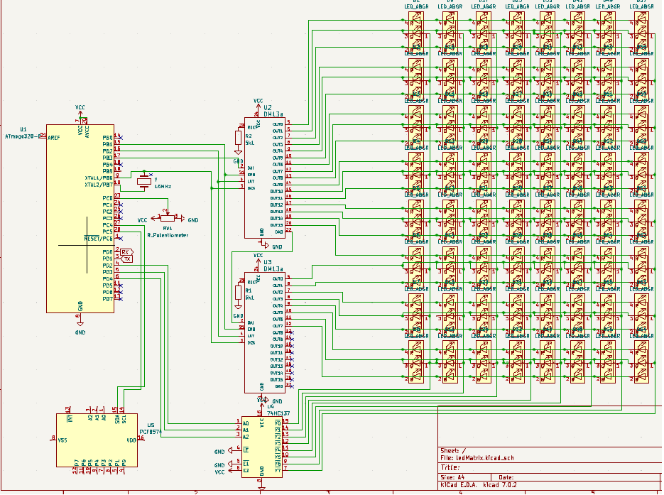

# 8x8 rgb displej s a/d prevodnikom a pomocnym i2c lcd displejom

# Schéma



# Princíp fungovania

Tento kód v skratke funguje nasledovne:

1. Vytvorí sa 3 rozmerná matica `volatile uint8_t matrix_rgb[PWM_SIZE][NUM_OF_ROWS][BYTES_PER_ROW] `, ktorá obsahuje hodnoty každej jednej LED, ktoré sa upravujú funkciami definovanými v súbore `utils.c`, kde sa špecifikuje riadok, stĺpec, farba a aktualizuje sa hodnota LED v tejto matici.

2. Volaním týchto funkcií na zmeny farby jednotlivých LEDiek, ako aj vyššio-úrovňové funkcie, napríklad na vypisovanie písmen vlastne menia hodnoty v tejto globálnej matici, a o vykresľovanie hodnôt v tejto matici sa stará interrupt vyvolaný časovačom pri zhode s hodnotou v makre `OCR_VAL`. Čím je táto hodnota vyššia, tým je nižšia obnovovacia frekvencia. 

3. Táto ISR vyvolaná časovačom zapíše do posuvných registrov cez SPI hodnoty jednotlivých LED, vždy len pre jeden riadok a jednu pwm úroveň.

4. Potom inkrementuje PWM úroveň až kým nedosiahne hodnoty PWM_MAX a pri ďalšom volaní ISR vykreslí hodnotu LED ďalšieho PWM bitu v poradí. Týmto spôsobom vieme dosiahnuť efekt viacerých farieb, než len siedmych, keby sme túto funkcionalitu nemali, ale na úkor rýchlosti obnovovania obrazu, čo môže byť pri veľkých displejoch problém. Pri tomto displeji však nie, pretože je dostatočné malý a kód dostatočne vyladený a rýchly.

5. Ak sa dosiahne maximálna hodnota PWM, vynuluje sa a inkrementuje sa riadok. Ak riadok dosiahne hodnoty ROWS_MAX, vynuluje sa. Týmto sme dosiahli efekt "viacerých riadkov" aj keď v skutočnosti sa vždy zapisuje len jeden riadok, jednej úrovne PWM. Robí sa to ale tak týchlo, že si to ľudské oko nevšimne. Táto technika sa volá *multiplexing*.

6. Taktiež je tu pripojený potenciometer, s 8 bitovým rozlíšením a/d prevodníka, ktorého hodnota je zapisovaná do globálnej premennej potentiometer_value pre ďalšie spracovanie v kóde.

7. Taktiež na pozadí funguje prerušenie pri prijatí dát z UARTU, ktoré slúži na ovládanie toho, čo sa má na tomto 8x8 displeji zobraziť. V skratke čaká, kým príjme reťazec ukončený '\r', ktorý by mal byť vo formáte `"FARBA_PISMENA,PISMENO,FARBA_POZADIA\r"`. Po prijatí tohto reťazca vykreslí požadované písmeno, v požadovaných farbách. Ak farby nepozná, tak nastaví hodnotu `BLACK`

8. Na i2c displeji sa pri každom prijatí dát z USARTU vykreslia aktuálne farby, znak a hodnota potenciometra.

# Použité technológie
- práca s I/O, napríklad pri riadení tranzistorov, ktoré poskytujú prívod prúdu do jednotlivých riadkov.
- A/D prevodník pre zaznamenávanie napätia na potenciometri
- I2C pre komunikáciu s displejom
- SPI pre komunikáciu s posuvnými registrami
- timer/counter pre obnovovanie hodnôt na displeji
- UART pre komunikáciu s počítačom

# Časovanie a obnovovacia frekvencia

Ak by sme chceli vedieť obnovovaciu frekvenciu tohto displeja, musíme správne načasovať generovanie interruptov v časovači. Čas medzi interruptami musí byť dostatočný pre úplný zápis dát cez SPI zbernicu, ako aj ostatné inštrukcie, vykonávané v `ISR(TIMER1_COMPA_vect)`, ktorá sa vykoná pri zhode hodnoty v časovači s hodnotou OCR_VAL.

Taktiež treba zvážiť, že spolu s časovaním sa na pozadí vykonávajú iné operácie asynchrónne, napríklad nastavovanie hodnôt jednotlivých pixelov, čítanie z AD prevodníka, alebo komunikácia s i2c zbernicou a teda je potrebné nechať pre tieto iné operácie dostatok času.

## Nastavenie časovača

Všeobecný vzťah pre frekvenciu časovania týchto interruptov je možné nájsť v datasheete na strane 121 a je následovný:
 
`focr = F_CPU/(2*PRESCALER*(OCR_VAL+1))`

Ak uvážime že:
- `F_CPU` je 16 MHz, frekvencia oscilátora na arduino uno
- `PRESCALER` je nastavený na 64
- `OCR_VAL` je nastavený na 30
Výslenú hodnotu frekvencie generovania interruptov je možné vypočítať následovne:

`focr = 16000000/(2*64*(30+1)) = 4032.25806452 Hz`

A teda čas pre generovanie jedného interruptu je:

`t = 1/focr = 1/4032.25806452 = 248 us`

Teda za týchto 248 mikrosekúnd je potrebné vykonať všetky inštrukcie v `ISR(TIMER1_COMPA_vect)`. 

Za predpokladu, že je táto podmienka splnená, obnovovacia frekvencia obrazu je v našom prípade:

`frefresh = focr/(PWM_SIZE*NUM_OF_ROWS)`, pretože nám treba pre každý riadok na displeji PWM_SIZE zápisov do registrov


A keďže:
- PWM_SIZE je nastavená na 8 (PWM môže dosiahnuť hodnoty od 0 po 8 bitov, kde 0 je 0% duty cycle a 8 bitov (0b11111111) je 100% duty cycle a  napr. 4 bity je 0b00001111, teda 50% duty cycle)
- NUM_OF_ROWS je 8, teda počet riadkov na displeji

Výsledná obvonovacia frekvencia je:

`frefresh = 4032.25806452/(8*8) = 63 Hz`, čo je pre ľudské oko postačujúca obnovovacia frekvencia, aby nepostrehlo "blikanie".

Pri zväčšení rozlíšenia PWM, alebo počtu riadkov by sme pre dosiahnutie rovnakého výsledku museli prerušenia generovať častejšie, čo je obmedzené rýchlosťou vykonávania inštrukcií v ISR, najmä zápisom do SPI, a môže to byť aj na úkor vykonávania iných asynchrónnych operácií.

## Prispôsobenie inštrukcií v `ISR(TIMER1_COMPA_vect)`

Funkcia vyzerá následovne:

```c    
ISR(TIMER1_COMPA_vect){
    static uint8_t current_row=0;
    static uint8_t pwm_level=0;


    PORTB |= (1 << BLANK_PIN); //Blank pin HIGH
    current_row = (!pwm_level) ? ((current_row + 1) & ROWS_MAX) : current_row;
    write_row_to_spi_rgb(pwm_level,current_row);
    pwm_level = (pwm_level + 1) & PWM_MAX;
    PORTB |= (1 << LATCH_PIN);
    PORTB &= ~(1 << LATCH_PIN); // Latch that new value (up and down)
    PORTB &= ~(1 << BLANK_PIN);	// Turn LEDS on
    PORTD = (current_row)<<2;	//(PORTD & ~(7 << 2)) | ((current_row) << 2);
}
void write_row_to_spi_rgb(uint8_t pwm_level,uint8_t row){
    for(int register_no = BYTES_PER_ROW-1; register_no>=0; register_no--){
        SPI_transfer(matrix_rgb[pwm_level][row][register_no]);
    }
}
inline void SPI_transfer(uint8_t data){
    SPDR = data;
    while(!(SPSR & (1 << SPIF)));
}
```
Inicializáciu statických premenných za nás robí kompilátor, a sú staticky alokované už v zdrojovom kóde, preto na ich vykonanie nie sú potrebné žiadne inštrukcie.
Čo sa týka ostatných operácií, bitové operácie zvyknú byť najrýchlejšie, čo sa týka ternárneho operátora (porovnávanie) a napríklad sčítavania, alebo prepisovania celého bajtu, tieto operácie sú náročnejšie na výpočtový výkon a potrebuju viac inštrukcií, ktoré môžu zaberať viac taktov procesora, preto ak je možné tak počet takýchto operácií treba minimalizovať.
V dnešnej dobe sú však kompilátory múdre a vedia niektoré veci optimalizovať za nás a preto sa nedá bez podrobnej analýzy strojového kódu určiť počet inštrukcií.
Pre neoptimalizovaný kompilátor AVR-GCC pre mikrokontrolér ATmega328P by sme mohli urobiť nasledujúce hrubé odhady:

### Inštrukcie okrem `write_row_to_spi_rgb`
1. Bitové zápisy: Budeme predpokladať, že bitové zápisy majú jednu inštrukciu. V kóde máme 4 takéto zápisy.
2. Logické operácie: Budeme predpokladať, že logické operácie, ako napríklad ternárny operátor, majú približne 2 inštrukcie (porovnávanie máme jedno).
3. Inkrementácie: Budeme predpokladať, že inkrementácie majú približne 2 inštrukcie (inkrementujeme 2 krát, ale v realite sa inkrementuje vždy raz, a druhý krát sa inkrementuje raz za NUM_OF_ROWS-krát. túto skutočnosť zanedbáme).
4. Prepisy celého bajtu: Budeme predpokladať, že prepisy celého bajtu majú približne 2 inštrukcie (hodnotu bajtu prepisujeme trikrát).
5. Bitové AND: Budeme predpokladať, že bitové AND majú jednu inštrukciu (AND robíme dvakrát).

Pri taktovacej frekvencii mikrokontroléra ATmega328P 16 MHz, každá inštrukcia trvá 1 cyklus. Avšak niektoré inštrukcie vyžadujú viac cyklov, napríklad pri prístupe k pamäti alebo skokoch. Budeme predpokladať, že s pamäťou sa nenarába a všetky operácie sa vykonávajú v internej pamäti registrov v procesore a preto budeme predpokladať, že každá inštrukcia zaberá jeden takt.

Celkový počet inštrukcií okrem volania funkcie je: `4+2+4+6+2=18` inštrukcií, teda 18 taktov procesora, teda celkový čas trvania týchto inštrukcií je `18/16000000=1125ns`.

Je dôležité si uvedomiť, že tieto hodnoty sú len hrubými odhadmi a môžu sa líšiť v závislosti od konkrétnej implementácie kompilátora a nastavení prekladača.


### Inštrukcie v `write_row_to_spi_rgb`
1. Volanie a návrat z funkcie `write_row_to_spi_rgb()` sú dve oddelené inštrukcie, ktoré, povedzme, zaberajú každá tri inštrukcie, takže za to by sme mohli pridať 6 inštrukcií.
2. Cyklus for: Budeme predpokladať, že inicializácia, inkrementácia a porovnanie v cykle for majú približne 6 inštrukcií.
3. Volanie funkcie SPI_transfer(): Keďže sme označili SPI_transfer() ako inline funkciu, kompilátor by mohol túto funkciu vložiť priamo do kódu write_row_to_spi_rgb(). To znamená, že namiesto toho, aby sme museli volať a následne sa vrátiť z funkcie (čo by nás stálo približne 6 inštrukcií), kód z SPI_transfer() sa vykoná priamo v write_row_to_spi_rgb(). To nám môže ušetriť pár inštrukcií, ale presný počet závisí od toho, ako kompilátor implementuje inline funkcie. Pre jednoduchosť predpokladajme, že inline funkcia nám ušetrí všetky inštrukcie spojené s volaním a návratom z funkcie, takže pre volanie SPI_transfer() budeme počítať len inštrukcie v samotnej SPI_transfer().
4. Inštrukcie v SPI_transfer(): predpokladáme, že inicializácia registra bude mať dve inštrukcie. Trvanie cyklu while však nemusíme rátať približne, ale vieme ho presne určiť z nastavenia časovania SPI.
```c 
    // Enable SPI, set as Master, and set clock rate to fck/16
	SPCR |= (1<<SPE)|(1<<MSTR)|(1<<SPR0);
```
Kedže `fsck = F_CPU/16 = 1MHz`, zápis celého bajtu bude s frekvenciou `fbyte=fsck/8 = 125kHz` a aby nám sedeli počty, vyjadríme si to počtom inštrukcií, teda `8*16=128 inštrukcií`.
Táto hodnota vyjadruje dobu čakania na vyprázdnenie registra, teda medzikrokové porovnávanie neuvažujeme. Môžme uvážiť posledné porovnanie, kedy podmienka nebude platiť, teda prirátame dve inštrukcie.

Teda keďže doba trvania funkcie SPI_transfer je (128+2) inštrukcií, opakuje sa to BYTES_PER_ROW-krát (teda 4 krát), počas čoho pripočítame tri inštrukcie pre každý cyklus a do celkového výsledku prirátame aj inštrukcie pre volanie funkcie, dostaneme odhad počtu inštrukcií pre zápis celého riadku cez SPI.

`N = (128+2+3)*4+6 = 538`
teda `fspi = 16000000/538 = 29,7397769517 kHz`

### Celkový počet inštrukcií

`Ncelkovy = 538 + 18 = 556 inštrukcií`, teda maximálna možná frekvencia generovania interruptov by mala byť menšia ako `fisrmax = 16000000/556 = 28,7769784173 kHz`, čo je s prihliadnutím na `focr = 16000000/(2*64*(30+1)) = 4032.25806452 Hz` splnené s prehľadom. V dôsledku toho má procesor po vrátení z ISR čas na ostatné záležitosti, ako napríklad čítanie z AD prevodníka, alebo komunikáciu s i2c, alebo s USARTom.

Je dôležité zdôrazniť, že uvedené hodnoty sú hrubé odhady a skutočný počet inštrukcií môže byť iný, v závislosti na použitom kompilátore a jeho nastaveniach. Avšak súčasná implementácia a nastavenia umožňujú dosiahnutie potrebného časovania a obnovovacej frekvencie pre náš LED displej, čoho dôkazom je fungujúci hardvér. 

Pre zhrnutie:

- Obnovovacia frekvencia displeja je približne 63 Hz.
- Maximálna frekvencia generovania interruptov je približne 28,77 kHz.
- Čas pre generovanie jedného interruptu je 248 mikrosekúnd.
- Celkový počet inštrukcií pre jedno prerušenie je odhadovaný na 556 inštrukcií.

Tieto hodnoty sú dostatočné pre plynulý chod LED displeja, pri zachovaní času pre iné asynchrónne operácie. V prípade zväčšenia rozlíšenia PWM alebo počtu riadkov by bolo potrebné generovať prerušenia častejšie, čo môže mať dopad na vykonávanie ostatných operácií a celkovú efektivitu systému.

## Časovanie AD prevodníka
Ak je prescaler nastavený na 128 a taktovacia frekvencia procesora je 16 MHz (štandardné nastavenie pre Arduino Uno, ktoré používa ATmega328P), frekvencia prevodníka je 16 MHz / 128 = 125 kHz.

Pokiaľ ide o časovanie volania ISR(ADC_vect), to je určené tým, ako rýchlo dokáže ADC dokončiť prevod. ADC ATmega328P potrebuje na prevod približne 13 ADC cyklov. Keďže frekvencia prevodníka je 125 kHz, čas potrebný na jeden prevod je 13 / 125 kHz = 104 µs. 
Teda `fadc = 125000/13 = 9615.38461538 Hz`. 

## Časovanie USART


Časovanie USART sa nastavuje zapísaním hodnoty vypočítanej makrom `UBRR = (F_CPU / (16 * BAUD)) - 1`, kde BAUD je počet bitov za sekundu, v našom prípade nastavenom na 9600. 
Výsledok tohto makra je 16 bitové číslo zapísane do registrov UBRR0L a UBRR0H.
Keďže máme nastavený USART na 8 bitov, bez parity, jeden start, jeden stop bit, počet bitov je 10, teda spracovanie jedného signálu je `fusart = 9600/10 = 960 Hz`

## Časovanie I2C
```c
    void setup_i2c(void)
    {
        // nastavenie rýchlosti I2C komunikácie
        TWSR = 0x00;
        TWBR = ((F_CPU / 100000UL) - 16) / 2;
    }
```
Register `TWSR` je nastavený na hodnotu 0, teda aj jeho bity TWPS0 a TWPS1 sú nastavené na 0, v dôsledku čoho je prescaler 0.

Vzorec na výpočet hodnoty `TWBR` je odvodený z datasheetu mikrokontroléra ATmega328P. Podľa tohto datasheetu, bitová rýchlosť I2C rozhrania (SCL) sa vypočíta pomocou nasledujúceho vzorca:

```
SCL = F_CPU / (16 + 2 * TWBR * PRESCALER)
```

kde `F_CPU` je taktovacia frekvencia procesora, `TWBR` je hodnota registra TWBR a `TWPS` je hodnota prescaleru (deliteľa taktu), ktorá je nastavená v registri TWSR.

Ak je prescaler vypnutý (tj. `TWPS = 0`, čo zodpovedá `TWSR = 0x00`), vzorec sa zjednoduší na:

```
SCL = F_CPU / (16 + 2 * TWBR)
```

Ak chceme vypočítať hodnotu `TWBR` pre danú bitovú rýchlosť (SCL), môžeme tento vzorec upraviť na:

```
TWBR = ((F_CPU / SCL) - 16) / 2
```

Toto je presne vzorec, ktorý je použitý vo funkcii `setup_i2c()`.

Hodnota `100000` je frekvencia hodinového signálu SCL (Serial Clock Line) v hertzoch. Táto hodnota je typická pre štandardnú rýchlosť I2C komunikácie, ktorá je 100 kHz.

I2C komunikačný protokol definuje tri štandardné rýchlosti:

1. Nízka rýchlosť (Low speed): 10 kHz
2. Štandardná rýchlosť (Standard mode): 100 kHz
3. Rýchly režim (Fast mode): 400 kHz

Niektoré moderné zariadenia podporujú aj vyššie rýchlosti, ako je rýchly režim plus (Fast mode plus): 1 MHz, alebo dokonca vysokorýchlostný režim (High-speed mode): 3.4 MHz.

Vzhľadom na tieto štandardy, hodnota `100000` v kóde znamená, že I2C komunikácia je nastavená na štandardný režim s rýchlosťou 100 kHz. Toto je typická a bezpečná rýchlosť pre väčšinu aplikácií, ktorá je podporovaná väčšinou I2C zariadení.

## Zhrnutie
- `focr = 4032,25806452 Hz` => `Tocr = 1/focr = 1/4032,25806452 s ≈ 248 us`
- `fusart = 960 Hz` => `Tusart = 1/fusart = 1/960 s = 1041,67 us`
- `fi2c = 100 kHz` => `Ti2c = 1/fi2c = 1/(100*1000) s = 10 us`
- `fadc = 9615,38461538 Hz` => `Tadc = 1/fadc = 1/9615.38461538 s ≈ 104 us`
- `F_CPU = 16 MHz` => `T_CPU = 1/16000000 = 62,5 ns`

# Súbor `setup.c`

## Popis
Tento súbor obsahuje implementáciu funkcií potrebných na nastavenie mikrokontroléru a jeho periférií pre riadenie 8x8 RGB LED displeja. 

## Použitie
Funkcie v tomto súbore sú určené na jednorázové inicializovanie mikrokontroléru a jeho periférií pred použitím displeja. Pre použitie displeja sa potom musia zavolať ďalšie funkcie, ktoré budú riadiť jeho správanie, definované v súbore `utils.c`.

## Funkcie
### `inline void setup_timer(void)`
Táto funkcia nastavuje Timer/Counter1 pre obnovenie stĺpcov LED displeja. Používa sa v móde CTC (Clear Timer on Compare) s prescalerom 64, čo znamená, že každý odpočítaný časový interval je 4 us. Po každom odpočítaní sa zavolá prerušenie. Hodnota, na ktorú sa porovnáva Timer/Counter1, sa nastavuje pomocou premennej `OCR_VAL`.

#### Vstupné parametre
- Funkcia nemá žiadne vstupné parametre

#### Návratová hodnota
- Funkcia nemá návratovú hodnotu

### `inline void setup_SPI(void)`
Táto funkcia nastavuje perifériu SPI (Serial Peripheral Interface) ako master a nastavuje jej rýchlosť na polovicu frekvencie taktu.

#### Vstupné parametre
- Funkcia nemá žiadne vstupné parametre

#### Návratová hodnota
- Funkcia nemá návratovú hodnotu

### `inline void setup_pins(void)`
Táto funkcia nastavuje piny mikrokontroléru, ktoré sú prepojené s LED displejom, ako výstupné piny. Taktiež inicializuje hodnoty pinov, ktoré sú následne využívané pri riadení displeja.

#### Vstupné parametre
- Funkcia nemá žiadne vstupné parametre

#### Návratová hodnota
- Funkcia nemá návratovú hodnotu

### `inline void setup_ADC(void)`
Táto funkcia nastavuje perifériu ADC (Analog-to-Digital Converter), ktorá sa používa na čítanie analógových hodnôt z A/D prevodníka. Nastavuje sa referenčné napätie na AVcc, prepiná sa vstup na A0 a nastavuje sa hodnota prescalera pre časovač ADC a povolí sa prerušenie pri konverzii.

#### Vstupné parametre
- Funkcia nemá žiadne vstupné parametre

#### Návratová hodnota
- Funkcia nemá návratovú hodnotu

### `void setup_USART(uint16_t ubrr)`
Táto funkcia nastavuje UART (Universal Asynchronous Receiver/Transmitter), ktorý slúži na komunikáciu medzi mikrokontrolérom a externými zariadeniami. Nastavuje sa rýchlosť prenosu dát podľa premennej ubrr, formát prenosu a povoluje sa prerušenie pri príjme a odosielaní dát.

#### Vstupné parametre
- uint16_t ubrr - nastavuje rýchlosť prenosu uartu. Vieme ju získať prepočtom z baudov vzorcom `ubrr = ((frekvencia_procesora / (16UL * rychlost_v_baudoch)) - 1)`

#### Návratová hodnota
- Funkcia nemá návratovú hodnotu


# Súbor `utils.c`

## Popis

Súbor `utils.c` obsahuje implementácie niektorých pomocných funkcií pre prácu s RGB LED displejom a niektorými ďalšími perifériami, ktoré sa používajú v mikrokontroléri Atmega328p. Konkrétne sa jedná o funkcie na aktualizáciu farieb na RGB LED displeji podľa HSV farbového modelu, na preklad číselnej hodnoty na signál PWM, na komunikáciu pomocou sériového portu USART a podobne.

## Funkcie

### `static inline uint8_t get_pwm_bits(uint8_t value)`

Funkcia `get_pwm_bits` slúži na výpočet počtu bitov pre PWM signál, ktorý sa používa na riadenie jasu LED diód. Na vstupe očakáva hodnotu jasu od 0 do 255. Výstupom je počet bitov pre PWM signál.

#### Vstupné parametre
- uint8_t value - hodnota jasu od 0-255

#### Návratová hodnota
- uint8_t - číslo, kde počet jednotiek v binárnej reprezentácií je úmerný veľkosti vstupu


### `inline void SPI_transfer(uint8_t data)`

Funkcia `SPI_transfer` slúži na prenos dát cez SPI rozhranie. Na vstupe očakáva dáta na prenos.

#### Vstupné parametre
- uint8_t data - bajt určený pre odoslanie po SPI zbernici.

#### Návratová hodnota
- Funkcia nemá návratovú hodnotu

### `void write_row_to_spi_rgb(uint8_t pwm_level, uint8_t row)`

Funkcia `write_row_to_spi_rgb` slúži na zápis riadku RGB LED displeja cez SPI rozhranie. Na vstupe očakáva úroveň PWM signálu a číslo riadku, ktorý sa má zapísať.

#### Vstupné parametre
- uint8_t pwm_level - momentálna hodnota PWM, hodnota od 0-PWM_MAX
- uint8_t row - momentálna hodnota riadku led matice od 0-ROW_MAX

#### Návratová hodnota
- Funkcia nemá návratovú hodnotu

### `void update_LED_color_r(uint8_t row, uint8_t column, uint8_t red)`

Funkcia `update_LED_color_r` slúži na aktualizáciu farby červenej pre konkrétnu LED diódu na zadanom riadku a stĺpci. Na vstupe očakáva číslo riadku, číslo stĺpca a hodnotu farby červenej.

#### Vstupné parametre
- uint8_t row - riadok LED diódy (od 0)
- uint8_t column - stĺpec LED diódy (od 0)
- uint8_t red - hodnota červenej od 0-255

#### Návratová hodnota
- Funkcia nemá návratovú hodnotu


### `void update_LED_color_g(uint8_t row, uint8_t column, uint8_t green)`

Funkcia `update_LED_color_g` slúži na aktualizáciu farby zelenej pre konkrétnu LED diódu na zadanom riadku a stĺpci. Na vstupe očakáva číslo riadku, číslo stĺpca a hodnotu farby zelenej.

#### Vstupné parametre
- uint8_t row - riadok LED diódy (od 0)
- uint8_t column - stĺpec LED diódy (od 0)
- uint8_t green - hodnota zelenej od 0-255

#### Návratová hodnota
- Funkcia nemá návratovú hodnotu

### `void update_LED_color_b(uint8_t row, uint8_t column, uint8_t blue)`

Funkcia `update_LED_color_b` slúži na aktualizáciu farby modrej pre konkrétnu LED diódu na zadanom riadku a stĺpci. Na vstupe očakáva číslo riadku, číslo stĺpca a hodnotu farby modrej.

#### Vstupné parametre
Funkcia nemá žiadne vstupné parametre

#### Návratová hodnota
- Funkcia nemá návratovú hodnotu

### `inline void update_row_rgb(uint8_t row, uint8_t red, uint8_t green, uint8_t blue)`

Funkcia `update_row_rgb` slúži na aktualizáciu farieb pre všetky LED diódy v zadanom riadku RGB LED displeja. Na vstupe očakáva číslo riadku, hodnotu farby červenej, zelenej a modrej.

#### Vstupné parametre
- uint8_t row - riadok LED diódy (od 0)
- uint8_t red - hodnota červenej od 0-255
- uint8_t green - hodnota zelenej od 0-255
- uint8_t blue - hodnota modrej od 0-255

#### Návratová hodnota
- Funkcia nemá návratovú hodnotu

### `inline void update_col_rgb(uint8_t col, uint8_t red, uint8_t green, uint8_t blue)`

Funkcia `update_col_rgb` slúži na aktualizáciu farieb pre všetky LED diódy v zadanom stĺpci RGB LED displeja. Na vstupe očakáva číslo stĺpca, hodnotu farby červenej, zelenej a modrej.

#### Vstupné parametre
- uint8_t col - stĺpec LED diódy (od 0)
- uint8_t red - hodnota červenej od 0-255
- uint8_t green - hodnota zelenej od 0-255
- uint8_t blue - hodnota modrej od 0-255

#### Návratová hodnota
- Funkcia nemá návratovú hodnotu

### `inline void update_matrix_rgb(uint8_t red, uint8_t green, uint8_t blue)`

Funkcia `update_matrix_rgb` slúži na aktualizáciu farieb pre všetky LED diódy na RGB LED displeji. Na vstupe očakáva hodnotu farby červenej, zelenej a modrej.

#### Vstupné parametre
Funkcia nemá žiadne vstupné parametre

#### Návratová hodnota
Funkcia nemá návratovú hodnotu

### `inline void update_LED_color_rgb(uint8_t row, uint8_t column, uint8_t red, uint8_t green, uint8_t blue)`

Funkcia `update_LED_color_rgb` slúži na aktualizáciu farby pre konkrétnu LED diódu na zadanom riadku a stĺpci RGB LED displeja. Na vstupe očakáva číslo riadku, číslo stĺpca a hodnotu farby červenej, zelenej a modrej.

#### Vstupné parametre
Funkcia nemá žiadne vstupné parametre

#### Návratová hodnota
Funkcia nemá návratovú hodnotu

### `void update_LED_color_hsv(uint8_t row, uint8_t column, uint8_t hue, uint8_t saturation, uint8_t value)`

Funkcia `update_LED_color_hsv` slúži na aktualizáciu farby pre konkrétnu LED diódu na zadanom riadku a stĺpci RGB LED displeja. Na vstupe očakáva číslo riadku, číslo stĺpca a hodnotu farebného tónu (hue), nasýtenia (saturation) a jasu (value) podľa HSV farbového modelu.

#### Vstupné parametre
- uint8_t row - riadok LED diódy (od 0)
- uint8_t column - stĺpec LED diódy (od 0)
- uint8_t hue - farebný tón (0-255)
- uint8_t saturation - saturácia (0-255)
- uint8_t value - jas (0-255)

#### Návratová hodnota
- Funkcia nemá návratovú hodnotu

### `void update_row_hsv(uint8_t row, uint8_t hue, uint8_t saturation, uint8_t value)`

Funkcia `update_row_hsv` slúži na aktualizáciu farieb pre všetky LED diódy v zadanom riadku RGB LED displeja podľa HSV farbového modelu. Na vstupe očakáva číslo riadku a hodnotu farebného tónu, nasýtenia a jasu.

#### Vstupné parametre
- uint8_t row - riadok LED diódy (od 0)
- uint8_t hue - farebný tón (0-255)
- uint8_t saturation - saturácia (0-255)
- uint8_t value - jas (0-255)

#### Návratová hodnota
- Funkcia nemá návratovú hodnotu

### `void update_col_hsv(uint8_t col, uint8_t hue, uint8_t saturation, uint8_t value)`

Funkcia `update_col_hsv` slúži na aktualizáciu farieb pre všetky LED diódy v zadanom stĺpci RGB LED displeja podľa HSV farbového modelu. Na vstupe očakáva číslo stĺpca a hodnotu farebného tónu, nasýtenia a jasu.

#### Vstupné parametre
- uint8_t col - stĺpec LED diódy (od 0)
- uint8_t hue - farebný tón (0-255)
- uint8_t saturation - saturácia (0-255)
- uint8_t value - jas (0-255)

#### Návratová hodnota
- Funkcia nemá návratovú hodnotu

### `void update_matrix_hsv(uint8_t hue, uint8_t saturation, uint8_t value)`

Funkcia `update_matrix_hsv` slúži na aktualizáciu farieb pre všetky LED diódy na RGB LED displeji podľa HSV farbového modelu. Na vstupe očakáva hodnotu farebného tónu, nasýtenia a jasu.

#### Vstupné parametre
- uint8_t hue - farebný tón (0-255)
- uint8_t saturation - saturácia (0-255)
- uint8_t value - jas (0-255)

#### Návratová hodnota
- Funkcia nemá návratovú hodnotu

# Súbor `bitmasks.c`

## Popis

Súbor `bitmasks.c` importuje bitmasky pre jednotlivé písmená, zo súboru `charset.c`, ktoré vie vypísať na RGB displej, ako aj funkciu na napísanie týchto písmen.

## Funkcie

### `void matrix_write_letter(char letter,const char* background_colour,const char* letter_colour)`

Funkcia najprv získa bitmasku pre požadované písmeno pomocou funkcie výberom z premennej `charset[character_to_display]`. Následne sa pre každý riadok a stĺpec tejto bitmasky preiteruje a zobrazia sa príslušné pixely na LED matici. Ak je daný bit nastavený, pixel sa zobrazí farbou písmena. Ak nie, zobrazí sa farbou pozadia. Farby sa prevádzajú z reťazca (napr. RED, BLUE, PURPLE...) na RGB pomocou funkcie `get_colour()`, definovanej v `colours.h`.

# Súbor `colours.c`

## Popis
Tento súbor obsahuje deklaráciu statického poľa štruktúr "Colour", ktoré obsahuje názvy farieb a ich RGB hodnoty. Súbor obsahuje aj funkciu "get_colour", ktorá vyhľadáva farbu v poli podľa názvu a vracia jej RGB hodnoty.

## Štruktúra "Colour"

Štruktúra "Colour" obsahuje nasledujúce položky:

- `name` - názov farby
- `red` - hodnota červenej zložky farby (0 až 255)
- `green` - hodnota zelenej zložky farby (0 až 255)
- `blue` - hodnota modrej zložky farby (0 až 255)

## Funkcia "get_colour"

Funkcia "get_colour" vyhľadáva farbu v statickom poli "colours" na základe zadaného názvu farby. Ak farba existuje v poli, funkcia vráti jej hodnoty RGB. Ak farba neexistuje v poli, funkcia vráti hodnoty RGB pre farbu "BLACK" (0, 0, 0).

#### Vstupné parametre
- `char* colour_name` - názov farby, ktorú chceme vyhľadať, ich zoznam je definovaný v odseku "Dostupné farby v poli "colours""

#### Návratová hodnota
- Funkcia nemá návratovú hodnotu

## Statické pole farieb "colours"

Statické pole "colours" obsahuje 42 položiek štruktúry "Colour", ktoré predstavujú rôzne farby s ich RGB hodnotami. Polia "red", "green" a "blue" obsahujú hodnoty od 0 do 255.

### Dostupné farby v poli "colours"

- RED
- GREEN
- BLUE
- YELLOW
- CYAN
- MAGENTA
- ORANGE
- PURPLE
- LIME
- TEAL
- PINK
- OLIVE
- LAVENDER
- BROWN
- BEIGE
- MAROON
- NAVY
- FOREST_GREEN
- GRAY
- DARK_RED
- DARK_GREEN
- DARK_BLUE
- DARK_CYAN
- DARK_MAGENTA
- DARK_YELLOW
- LIGHT_YELLOW
- LIGHT_CYAN
- LIGHT_MAGENTA
- LIGHT_GREEN
- LIGHT_BLUE
- LIGHT_GRAY
- DARK_GRAY
- BEIGE2
- OLIVE_DRAB
- KHAKI
- SANDY_BROWN
- SIENNA
- CORAL
- SALMON
- TOMATO
- ORCHID
- THISTLE
- PLUM
- DEEP_PINK

Ak potrebujeme pridať alebo upraviť farby v poli, musíme aktualizovať definíciu štruktúry "Colour" a pole "colours".

# Súbor `main.c`


## Knižnice

Program využíva štandardné knižnice pre jazyk C, ako sú `avr/io.h`, `avr/interrupt.h`, `math.h`, `util/delay.h`, `stdlib.h`, `string.h` a `stdio.h`, ako aj vlastné knižnice `setup.h`, `i2c_lcd.h`, `utils.h`, `animations.h`, `bitmasks.h` a `colours.h`.

## Globálne premenné

- `potentiometer_value` - premenná typu `uint8_t`, ktorá obsahuje hodnotu prevodníka A/D. Je aktualizovaná v interrupt service routine pre A/D prevodník.

- `matrix_rgb` - globálny 3D array, ktorý obsahuje RGB hodnoty každého LED na matici LED displeja, ako aj hodnoty PWM. Má tri rozmery: veľkosť PWM, počet riadkov a počet bajtov na riadok. Do tohto arrayu nezapisujeme priamo, ale cez funkcie, definované v `utils.c`, ktoré prerátavajú hodnoty riadkov, stĺpcov, jasu a podobne a zapisujú ich do tohto arrayu.

- `receiving_str` - premenná typu `uint8_t`, ktorá sa používa v interrupt service routine pre USART na indikovanie, či sa práve prijíma reťazec.

- `received_str` - retazec, ktoý sa prijal

## Interrupt Service Routines

- `TIMER1_COMPA_vect` - táto funkcia sa spúšťa pri príchode signálu z časovača TIMER1. Aktualizuje sa hodnota premenných `current_row` a `pwm_level`, čím sa ovláda PWM signál pre riadenie jasu LED diód.

- `ADC_vect` - táto funkcia sa spúšťa po dokončení prevodu A/D prevodníka. Premenná `potentiometer_value` sa aktualizuje na hodnotu, ktorú prevodník vráti.

- `USART_RX_vect` - táto funkcia sa spúšťa pri prijatí dát z USART. V tomto prípade slúži na príjem reťazca, ktorý obsahuje farby a znak, ktorý sa má zobraziť na LED matici, vo formáte `"FARBA_PISMENA,PISMENO,FARBA_POZADIA"` a je ukončený znakom '\r'.

## Funkcia `main`

Na začiatku funkcie sa vykonajú inicializačné kroky pre rôzne periférie, ako napríklad nastavenie pinov, SPI rozhrania, časovača, USART rozhrania, I2C rozhrania, LCD displeja a A/D prevodníka. Po inicializácii sa spúšťa cyklus, ktorý sa vykonáva neustále.

V tomto cykle sa neustále kontoluje, či sa práve nepríjma reťazec cez USART rozhranie. Ak áno, tak sa reťazec spracuje a na základe neho sa zobrazí na LED matici a LCD displeji. Reťazec obsahuje informácie o farbe písma, pozadia a písmene, ktoré sa majú zobraziť.

Tieto informácie sa spracúvajú funkciou sscanf, ktorá z reťazca vyextrahuje jednotlivé hodnoty. Potom sa volá funkcia matrix_write_letter, ktorá napíše dané písmeno na maticu LED displeja s farbou písma a pozadia. Okrem toho sa na LCD displeji zobrazia informácie o farbe písma, pozadia a hodnota z A/D prevodníka.


# Súbor `i2c_lcd.c`

Tento súbor obsahuje funkcie pre komunikáciu s I2C LCD displejom pomocou PCF8574 I/O expanderu. 

## Funkcie

### `void setup_i2c(void)`
Táto funkcia nastavuje rýchlosť I2C komunikácie.

### `void lcd_send_command(uint8_t cmd)`
Táto funkcia slúži na odosielanie príkazov na LCD displej. Parametrom funkcie je príkaz, ktorý sa má poslať na displej.

### `void lcd_send_byte(uint8_t chr)`
Táto funkcia slúži na odosielanie znakov na LCD displej. Parametrom funkcie je znak, ktorý sa má poslať na displej.

### `void lcd_send_string(uint8_t row, uint8_t col, char *str)`
Táto funkcia slúži na odosielanie reťazcov na LCD displej. Parametrami funkcie sú riadok a stĺpec, kde sa má reťazec zobraziť a samotný reťazec.

### `void lcd_send_char(uint8_t row, uint8_t col, char character);`
Táto funkcia slúži na odosielanie charakterov na LCD displej. Parametrami funkcie sú riadok a stĺpec, kde sa má charakter zobraziť a samotný charakter.

### `void lcd_send_number_at_end(uint8_t row, int number);`
Táto funkcia slúži na odosielanie čísiel na LCD displej. Parametrami funkcie je riadok, kde sa má číslo zobraziť, spolu so samotným číslom.

### `void lcd_clear(void)`
Táto funkcia slúži na vymazanie obsahu displeja.

### `void setup_lcd(void)`
Táto funkcia inicializuje LCD displej. 

## Interné funkcie

### `static void i2c_start(void)`
Táto interná funkcia slúži na odoslanie start bitu pri komunikácii po I2C zbernici.

### `static void i2c_stop(void)`
Táto interná funkcia slúži na odoslanie stop bitu pri komunikácii po I2C zbernici.

### `static void i2c_write(uint8_t data)`
Táto interná funkcia slúži na zápis dát do registra.

### `static uint8_t i2c_receive_ack(void)`
Táto interná funkcia slúži na prijatie ACK po odoslaní dát pri komunikácii po I2C zbernici.

### `static uint8_t i2c_receive_nack(void)`
Táto interná funkcia slúži na prijatie NACK po odoslaní dát pri komunikácii po I2C zbernici.

### `static uint8_t i2c_component (uint8_t address)`
Táto interná funkcia slúži na komunikáciu s konkrétnym komponentom po I2C zbernici. Parametrom funkcie je adresa komponentu.

### `static void i2c_send_byte (char data)`
Táto interná funkcia slúži na odoslanie bajtu po I2C zbernici. Parametrom funkcie je bajt, ktorý sa má odoslať.

### `static void i2c_send_string (uint8_t *datas)`
Táto interná funkcia slúži na odoslanie reťazca po I2C zbernici. Parametrom funkcie je reťazec, ktorý sa má odoslať.
